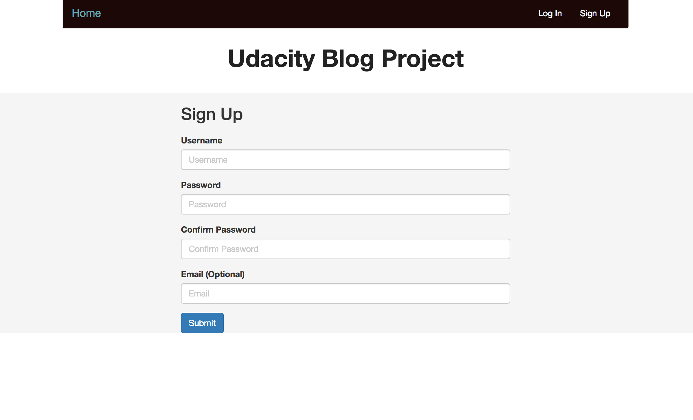
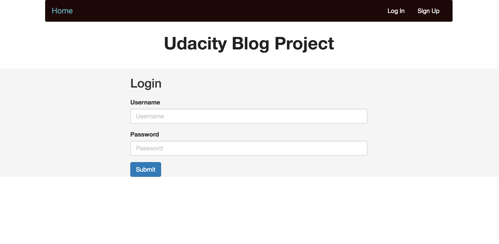
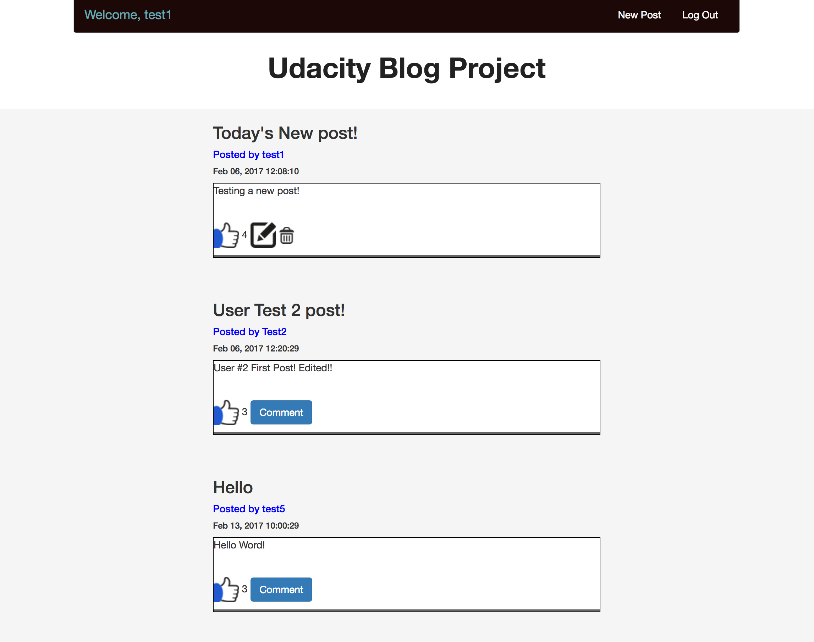

# Multi User Blog

## Project Overview

The objective of this project was to build a multi user blog (along the lines of Medium) where user can sign in and post blog posts as well as "Like" and "Comment" on other posts made on the blog. The project will be hosted using [Google App Engine](https://cloud.google.com/appengine/), which is a powerful platform by Google to build web and mobile apps that scale automatically. It was also required to create an authentication system for users to be able to register and sign in and then create blog post. 

___

## To Set up and Run

### Locally 

* Clone of download this repository 

* Ensure you have or download Python [Download Python here](https://www.python.org/downloads/)
* [Install Google App Engine SDK](https://cloud.google.com/appengine/docs/python/download)

* [Sign Up for a Google App Engine Account(Free)](https://cloud.google.com/appengine/)

* Create a new project in Google's Developer Console using a unique name

* Follow the the App Engine Quickstart to get a sample app up and running if you like

* Otherwise, open your terminal on your local computer 

* Change Directories(cd), into the file path of this project 

* Then use the command *dev_appserver.py .* to run a copy of the app on your own computer, and access it at http://localhost:8080/

___

## Screenshots

### The Multi User Blog Welcome Page

  

### The Multi User Blog User Signup Page

 

### The Multi User Blog Login Page

 

### The Multi User Blog Posts View Page
 
 

---

## Sources

* Udacity Discussion Board
* [Pep8 Python Style Guide](https://www.python.org/dev/peps/pep-0008/)
* [Udacity's Intro to Backend Course](https://www.udacity.com/course/intro-to-backend--ud171)

---
## Planned Improvements

* Improve the Front End styling of the blog

